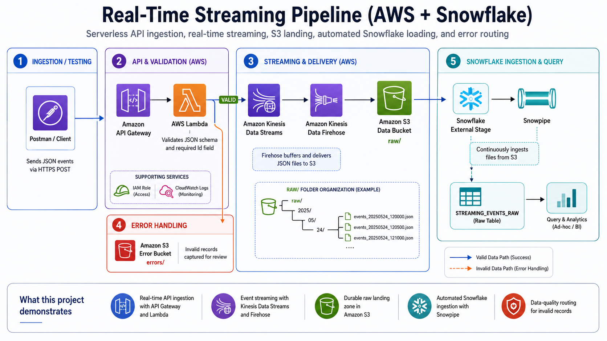

# Real-Time Streaming Pipeline with AWS and Snowflake

## Overview

This project builds an end-to-end real-time streaming pipeline using AWS and Snowflake.

The pipeline simulates an external application sending JSON events through an API. Valid events are streamed through AWS services, stored in Amazon S3, and automatically loaded into Snowflake through Snowpipe. Invalid events are routed to a separate S3 error bucket for review.

```text
Postman / API Client
→ Amazon API Gateway
→ AWS Lambda validation
→ Amazon Kinesis Data Streams
→ Amazon Data Firehose
→ Amazon S3 raw data bucket
→ Snowflake external stage
→ Snowpipe
→ Snowflake raw table
```

Invalid records follow a separate path:

```text
Postman / API Client
→ Amazon API Gateway
→ AWS Lambda validation
→ Amazon S3 error bucket
```

## Architecture Diagram



## Why This Project Matters

Real-time data pipelines are used when applications need to capture events as they happen instead of waiting for scheduled batch jobs. Examples include purchases, clickstream activity, fraud events, IoT readings, logs, and operational alerts.

This lab demonstrates how cloud services work together to ingest, validate, stream, store, and query event data.

## Services Used

| Service | Purpose in this project |
| --- | --- |
| Postman | Sends test HTTP POST requests into the pipeline |
| Amazon API Gateway | Provides the public API endpoint for incoming JSON events |
| AWS Lambda | Validates each event and routes it to the correct destination |
| Amazon Kinesis Data Streams | Captures valid events as a real-time stream |
| Amazon Data Firehose | Delivers streaming events from Kinesis into S3 |
| Amazon S3 | Stores valid raw JSON files and invalid error records |
| AWS IAM | Provides permissions for Lambda, Kinesis, Firehose, S3, and Snowflake access |
| CloudWatch Logs | Captures Lambda execution logs for troubleshooting |
| Snowflake | Stores and queries the ingested event data |
| Snowpipe | Automatically loads new S3 files into Snowflake |

## Valid Data Flow

A valid JSON event contains a non-blank `Id` value.

```json
{
  "Id": "3001",
  "customer_id": "C300",
  "event_type": "purchase",
  "amount": 199.99,
  "payment_type": "card",
  "event_time": "2026-05-26T12:00:00Z"
}
```

When this event is sent through Postman:

1. API Gateway receives the HTTP POST request.
2. API Gateway invokes Lambda.
3. Lambda parses and validates the JSON body.
4. Lambda sends valid records to Kinesis Data Streams.
5. Firehose reads from Kinesis and writes JSON files into the S3 `raw/` prefix.
6. Snowpipe detects new S3 files and loads them into a Snowflake raw table.
7. The record becomes queryable in Snowflake.

## Invalid Data Flow

An invalid event has a missing or blank `Id` field.

```json
{
  "Id": "",
  "customer_id": "C301",
  "event_type": "purchase",
  "amount": 49.99,
  "payment_type": "card",
  "event_time": "2026-05-26T12:05:00Z"
}
```

When this event is sent through Postman:

1. API Gateway receives the request.
2. Lambda validates the event.
3. Lambda identifies the blank `Id` field.
4. Lambda writes the record to the S3 error bucket under the `errors/` prefix.

This keeps bad records from breaking the main ingestion flow while still preserving them for troubleshooting.

## What the Postman/API Test Proves

Before connecting Snowflake, I tested the AWS side of the pipeline with Postman.

That test proved:

```text
Postman sent JSON
→ API Gateway accepted the HTTP request
→ Lambda parsed and validated the payload
→ valid records moved into Kinesis
→ Firehose delivered records into S3
→ invalid records were routed to the S3 error bucket
```

After Snowpipe was configured, I sent another valid event and confirmed the record appeared in Snowflake. That final query proved the full end-to-end path worked.

## Repository Structure

```text
real-time-streaming-pipeline-aws-snowflake/
├── README.md
├── architecture/
│   ├── architecture-overview.md
│   └── design-decisions.md
├── config/
│   ├── lambda-environment-variables.example
│   ├── sample-invalid-event.json
│   └── sample-valid-event.json
├── diagrams/
│   └── architecture-diagram.png
├── docs/
│   ├── cleanup-checklist.md
│   ├── glossary.md
│   ├── project-status.md
│   ├── screenshot-checklist.md
│   └── troubleshooting.md
├── lambda/
│   └── lambda_function.py
├── notes/
│   └── private/
│       └── postman-click-by-click.md
├── postman/
│   └── sample-requests.md
├── screenshots/
│   └── project screenshots
└── snowflake/
    ├── 01-create-database-schema-table.sql
    ├── 02-create-storage-integration.sql
    ├── 03-create-stage-file-format.sql
    ├── 04-create-snowpipe.sql
    └── 05-validation-queries.sql
```

## Lambda Validation Logic

The Lambda function reads the JSON body from API Gateway and checks the `Id` field.

```python
if event_id is None or event_id == "":
    # write invalid record to S3 error bucket
else:
    # send valid record to Kinesis
```

For this lab, the validation rule is intentionally simple. In a production system, this could be expanded to validate schema, required fields, data types, timestamp format, accepted event types, duplicate events, and data quality rules.

## Snowflake Raw Table

The Snowflake raw table stores the event payload as a `VARIANT` column.

```sql
CREATE OR REPLACE TABLE STREAMING_EVENTS_RAW (
    DATA VARIANT,
    LOAD_TIMESTAMP TIMESTAMP_NTZ DEFAULT CURRENT_TIMESTAMP()
);
```

Using `VARIANT` is helpful for raw JSON ingestion because it allows semi-structured data to land first. Later transformation layers can flatten and type the fields into cleaner analytics-ready tables.

## Screenshots / Evidence

The screenshots folder contains proof that each part of the pipeline was configured and tested, including:

- IAM role and permissions
- S3 data and error buckets
- Kinesis Data Stream
- Firehose delivery stream
- Lambda function, environment variables, and test events
- API Gateway deployment and Lambda integration
- Postman valid request
- S3 raw output
- S3 error output
- Snowflake query result showing loaded data

## Current Status

Completed:

- AWS budget/cost awareness step reviewed
- IAM role created
- S3 data and error buckets created
- Kinesis Data Stream created
- Firehose delivery stream created
- Lambda validation and routing created
- Lambda valid and invalid tests passed
- API Gateway created and deployed
- Postman valid request succeeded
- S3 raw output confirmed
- S3 error output confirmed
- Snowflake/Snowpipe setup completed
- Snowflake query confirmed end-to-end success

Remaining / optional improvements:

- Add more formal Snowflake transformed views
- Add Terraform version of the infrastructure
- Add CI/CD deployment notes
- Add CloudWatch metric screenshots
- Add cost cleanup screenshots after resources are deleted

## Security Notes

This is a learning lab. Some AWS managed policies used here are intentionally broad to move quickly through the bootcamp project.

For production, permissions should be restricted to least privilege. For example, Lambda should only access the specific Kinesis stream and S3 buckets it needs, and Snowflake should only read from the exact S3 path used for ingestion.

## Cleanup

This project uses cloud resources that can incur cost. After testing, clean up unused resources:

- API Gateway
- Lambda function
- Kinesis Data Stream
- Firehose delivery stream
- S3 objects and buckets
- IAM roles/policies created only for the lab
- Snowflake pipe/stage/table/database if no longer needed
- Snowflake warehouse if it is running

See `docs/cleanup-checklist.md` for a more detailed cleanup list.

## What I Learned

This project helped connect several important data engineering concepts:

- API-based ingestion
- Serverless validation
- Streaming data movement
- Error routing / quarantine patterns
- Raw S3 landing zones
- Snowflake external stages
- Snowpipe auto-ingestion
- Querying semi-structured JSON data in Snowflake

The biggest learning outcome was seeing how each service has a specific job in the pipeline, and how testing each section separately makes troubleshooting much easier.
